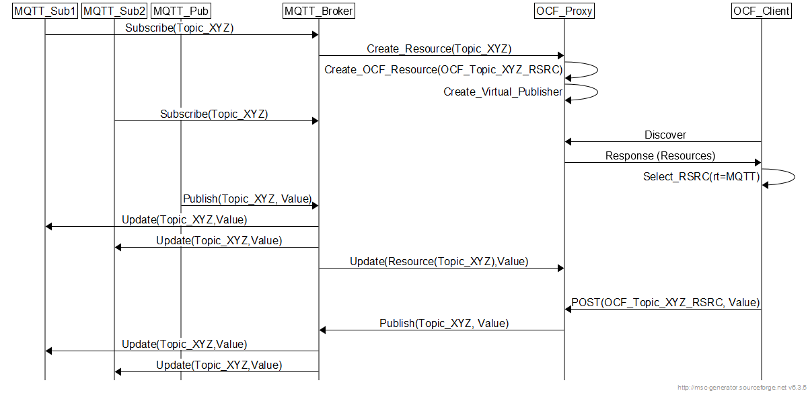

# mqtt-ocf

## Description

This project provides a node.js based gateway for interconnecting MQTT publishers/subscribers to OCF based clients.  It is based on the node.js [mosca](https://github.com/mcollina/mosca) MQTT broker and [iotivity-node](https://github.com/intel/iotivity-node) Iotivity implementation in node.js. In summary, an OCF resource is created for each identified MQTT topic at the MQTT broker. Then the MQTT topic and corresponding OCF resource are considered as one logical entity. The communication among MQTT and OCF clients is bi-directional:

- A MQTT publisher updating a specific MQTT topic will push the update to the MQTT subscribers and update the the resource value for the corresponding OCF resource. Subscribing OCF clients (e.g. observer) or OCF clients performing a GET shall then get the updated resource value. 
- An OCF client performing a POST operation on the OCF resource will cause an update to be pushed to the MQTT subscribers.

Currently, **all OCF resource/mqtt topic data is treated as strings**. Future versions should resolve this issue.

Future versions shall also consider the case of offering an OCF service on some proper resource (say /oic/mqttgw) that will enable interested OCF servers to create MQTT topics corresponding to their resources on the gateway. The gateway shall then subscribe to the registered OCF resources and publish the updated resource values on the corresponding MQTT topic.

sudo apt-get install libglib2.0-dev

now 

## Installation

This package has been tested on Linux only. Should run similarly on  OSX. Since iotivity-node downloads  [IoTivity](http://iotivity.org) and builds parts of it, be warned that installation on a computer that has not installed IoTivity before, may involve doing a lot of steps to install libraries and dependencies that IoTivity needs. See the following subsection for some commands that can be handy for a Ubunto based Linux distribution to expedite the installation process. 

For installation do the following:

1. Make sure [node](https://nodejs.org) version 4.2.6 or later is up and running (It should actually work on older versions, but this is the version that I tested it with). This means that:
	1. the command `node -v` reports a version  4.2.6 or later
	1. the directory in which the `node` binary can be found is listed in the `PATH` environment variable.
1. Install the following packages, which your distribution should provide:
   1. unzip, scons (version 2.51), git, make, autoconf
   1. Development headers for libuuid, and glib2
   1. A C compiler and a C++ compiler (gcc-4.7 or later)
1. Clone this repository.
1. cd `mqtt-ocf`
1. Run `npm install`. This should download iotivity-node, mqtt, and mosca packages and their dependencies. Downloading iotivity-node install iotivity. More details can be found in the [iotivity-node](https://github.com/intel/iotivity-node) package repository.

### Some Useful Installation Commands on Ubunto-base Linux Systems
On systems like Ubunto and Mint, the following commands can be handy to install some of the tools/libraries needed by IoTivity. Still not every things but it should be helpful.
1. scons: `sudo apt-get install scons`
1. glib2: `sudo apt-get install libglib2.0-dev`
1. libuuid: `sudo apt-get install uuid-dev`
1. sqlite3: `sudo apt-get install sqlite3 libsqlite3-dev`
1. autoconf, autotools-dev, automake:
  `sudo apt-get install autoconf`
  `sudo apt-get install autotools-dev`
  `sudo apt-get install automake`

Note that there are reports that latest versions of gcc/g++ can result in some IoTivity compilation errors. Bettter use gcc 4.7 or 5. 

## Detailed Description and Flows
The package consists of one module the  mqtt-ocf.js which is called the "server". The mqtt-ocf server is comprised of two logical entities: An MQTT Broker and an OCF Proxy. There are three additional folders:

- js: this contains helper scripts comprising mqtt publishers and subscribers and OCF observer and post clients. 
- acl: this contains provisioning and ACL json files and utility to install the security configuration files for OCF.
- images: some PNG images used for this Readme file. 

The package runs as a full-fledged MQTT broker. MQTT publishers and subscribers are configured with the proper IP address of the MQTT broker (as usual). Current version has a limitation that **MQTT transactions are not secured**. This will be added in future releases. The mqtt-ocf MQTT Broker has special handlers for MQTT publisher and subscriber requests that perform the necessary transactions to create/update OCF resources hosted in the OCF Proxy.

### MQTT Publisher Initiated Flow

A publisher publishing on a MQTT topic for the first time will cause the mqtt-ocf server to create an OCF resource and a virtual publisher to handle updates from the OCF side to the MQTT side. The OCF resource value will be kept updated with all future publish requests. Subscribing MQTT clients will be pushed with the values as usual with MQTT operation. So, the existence of OCF resource is totally transparent. However, an OCF client can post updates to the OCF resource which will also cause an update in the MQTT topic and get pushed to the MQTT subscribers. The MQTT subscribers are not aware whether the update is via a MQTT publisher or an OCF client. This is depicted in the following figure. Note that the modules MQTT_Broker and OCF_Proxy are the entities comprising the  mqtt_ocf server. 

 

### MQTT Subscriber Initiated Flow

The system also handles the case when a MQTT subscriber send a subscribe request to a new topic. This is less likely as typically a subscriber subscribes to an already existing MQTT topic. However, typically MQTT brokers do not reject such requests and keep the topic available for potential future publishers. Here, the mqtt-ocf server creates the OCF resource and an internal virtual publisher client. As in the previous case, transparent update to the MQTT topic and its associated OCF resource is achieved. The OCF client can GET/Observe OR Post to the OCF resource which reflects the corresponding value from/to the MQTT topic. 

### Examples

The JavaScript examples are located in [js/](./js/) . 

#### Setting the OCF Provisioning and Security Credentials

In order to be able to run the mqtt-ocf server, all OCF transactions must be secured. mqtt-ocf uses the simplest type of security authentication which is the usage of pre-shared keys (PSKs). The package provide example json files that contain proper credentials for the mqtt-ocf server script and the multiple clients that are used to demonstrate the package. Currently there are three json files:

1. working-server.json: This has ACL entries for the resources created for the  OCF proxy server and has wild card entries for those unknown resources that will be created as MQTT topics are added by MQTT transactions. It also has credentials for two clients with PSK credentials. 
2. working-client.json: An OCF client credential file with proper PSK to be able to access the mqtt-ocf server. 
3. working-client2.json: Identical to 2 but with a different Device UUID.

When operated with these JSON files, all OCF devices are considered already provisioned and owned. This is not a limitation as any other OCF provisioning model can be supported by simply changing the security/provisioning json files. Interested readers should consult Iotivity wiki guide on [provisioning](https://wiki.iotivity.org/provisioning) and the [presentation](https://openconnectivity.org/wp-content/uploads/2018/06/4.-Security-Introduction-Architecture.pdf) by Nathan Heldt-Sheller on OCF security. 

To run the examples, the first thing we need to do is setup the security and provisioning credentials. Iotivity-node stores security-related information for a given script in a pre-defined directory. It does so by creating a directory `${HOME}/.iotivity-node`. Thereunder, it creates directories whose name is the sha256 checksum of the absolute path of the given script and the security credential file is named `oic_svr_db.dat`. To facilitate this job, we provide a shell script that can be used to automate this job in the acl folder called the `setup_sec_json.bash`. 

Below we show how to setup the security credentials for mqtt-ocf. First, make sure that  `setup_sec_json.bash`has execute permission. If not do a `chmod 755 setup_sec_json.bash`.

1. In the package root directory where mqtt-ocf.js is found, issue the following command:

    `acl/setup_sec_json.bash  mqtt-ocf.js  acl/working-server.json`

2. cd js and issue the following commands and repeat for the remaining clients that you want to test with. We mainly demonstrate with `client-arg.observe.js`  and `client.periodicput.coaps.js`.

   a-  `../acl/setup_sec_json.bash  client-arg.observe.js  ../acl/working-client.json`

   b-  `../acl/setup_sec_json.bash  client.periodicput.coaps.js  ../acl/working-client2.json`

You will now be ready to move to the next step. 

#### Execution 

First make sure no firewall is running (or one is properly configured to allow MQTT and iotivity-related traffic and especially multicast traffic) on the machine(s) where these applications are running.

1. Go to the root directory of `mqtt-ocf.js`, open a shell terminal, execute `node mqtt-ocf.js` OR if interested in watching closely what is going on then `NODE_DEBUG=ocf_mqtt node mqtt-ocf.js`
   Don't ask me why the `ocf_mqtt` identifier is used, just how it was started in the `debuglog` statements.   Can be changed effortlessly. 

2. Now `cd js`. Each of the following will need its own terminal or tab. 

3. Issue the first MQTT publisher  by issuing`node pub.js`. This publishes a topic called `LEDToggle`. The mqtt-ocf server creates the OCF resource `/a/mqtt/LEDToggle`

4. Issue MQTT subscriber  by issuing `node sub.js` . This subscribes to the `LEDToggle` topic. You should be starting to see the logs of the pushed updates from the publisher. 

5. Issue the second MQTT publisher  by issuing `node pub2.js`. This publishes a topic called `TestMQTT`. The mqtt-ocf server creates the OCF resource `/a/mqtt/TestMQTT`.

6. Issue the second MQTT subscriber by issuing `node sub2.js`. This subscribes to the `TestOcfTopic` topic. No MQTT publisher is publishing to this topic. Nothing happens here in the subscriber log. However, the `mqtt-ocf` server creates the resource `/a/mqtt/TestOcfTopic`. 

7. Now, time to start some OCF clients. Issue an observer client  by issuing 

   `node  client-arg.observe.js /a/mqtt/LEDToggle 100` 

   what this does is observing the `/a/mqtt/LEDToggle` resource for 100 times. You can run this again with different resources (e.g. the /a/mqtt/TestMQT ). You should then get the same updates as any MQTT subscriber to the topic. 

8. Start two OCF Post clients by issuing the commands below. Note that the post client generates random strings taking the value from `OCFTestRandomString000` to `OCFTestRandomString999`

   `node  client.periodicput.coaps.js /a/mqtt/LEDToggle 100`
   
   The first MQTT subscriber shall now get updates from both the MQTT publisher and OCF Post client. Then create another post client
   
   `node  client.periodicput.coaps.js /a/mqtt/TestOcfTopic 100`

   The second MQTT subscriber shall now get the updates posted by the OCF Post client. 

That's it, Voila :-) **We have now a fully versatile system that interconnects MQTT and OCF Worlds!**

A handy tool that helped me in the development was the [OCFSecure/client](https://github.com/iotivity/iotivity/blob/master/examples/OCFSecure/client.c) program of the IoTivity package. 

## Acknowledgements

Would like to ACK the tiresome efforts of [Gabriel Schulhof](https://github.com/gabrielschulhof) who really helped me a lot understand node.js and iotivity-node. 

Would also like to ACK Nathan Heldt-Sheller for good insights on OCF security. 
